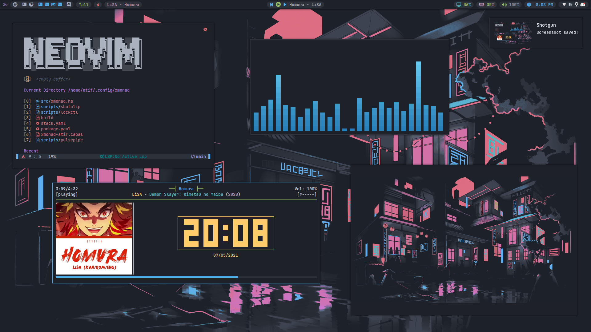
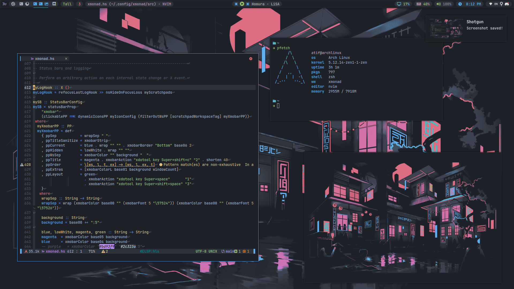

# XMonad

my [xmonad](https://github.com/xmonad/xmonad) configuration

## Table of Contents

- [Preview](#preview)
- [About Setup](#about-setup)
- [Installation](#installation)
- [Keybind](#keybind)
- [License](#license)

### Preview




### About Setup

- OS: [Arch Linux](https://archlinux.org/)
- WM: [XMonad](https://github.com/xmonad/xmonad)
- Bar: [Xmobar](https://github.com/jaor/xmobar)
- Prompt: [XMonad Prompt](https://github.com/xmonad/xmonad-contrib)
- Font:
  - Monospace: [JetBrains Mono](https://github.com/JetBrains/JetBrainsMono)
- Colorscheme: onedark (slightly changed)
- Terminal: [st](https://github.com/AtifChy/st)
- Shell: [zsh](https://github.com/AtifChy/dotfiles/tree/main/.config/zsh)
  - Plugin Manager: [zinit](https://github.com/zdharma/zinit)
  - Prompt: [starship](https://github.com/AtifChy/dotfiles/blob/main/.config/starship.toml)
- Editor: [Neovim](https://github.com/AtifChy/dotfiles/tree/main/.config/nvim)
- Compositor: [Picom](https://github.com/AtifChy/dotfiles/blob/main/.config/picom/picom.conf)
- Image Preview: [Sxiv](https://github.com/muennich/sxiv)
- Wallpaper:
  <details><summary>Click Me</summary>

  

  </details>

- Wallpaper Setter: [hsetroot](https://github.com/himdel/hsetroot)
- Screenshot: [shotgun](https://github.com/neXromancers/shotgun)
  - Selector: [slop](https://github.com/naelstrof/slop)
  - Script: [Here](https://github.com/AtifChy/xmonad/blob/main/scripts/shotclip)
- Night Light: [Redshift](https://github.com/jonls/redshift)
- Music Player: [ncmpcpp](https://github.com/AtifChy/dotfiles/tree/main/.config/ncmpcpp) + [mpd](https://github.com/AtifChy/dotfiles/blob/main/.config/mpd/mpd.conf) + mpc
- Video Player: [mpv](https://github.com/AtifChy/dotfiles/blob/main/.config/mpv/mpv.conf)
- Notification Daemon: [Dunst](https://github.com/AtifChy/dotfiles/blob/main/.config/dunst/dunstrc)
- Tray: [Stalonetray](https://github.com/kolbusa/stalonetray)
- [DOTFILES](https://github.com/AtifChy/dotfiles)

### Installation

- First you need `stack` install it using your package manager or follow their [installation guide](https://docs.haskellstack.org/en/stable/install_and_upgrade/) to install it.

- Now clone the repo to `~/.config/xmonad`

```
git clone https://github.com/AtifChy/xmonad.git ~/.config/xmonad
```

- After cloning it go to that dir `cd ~/.config/xmonad` and run

```
stack init && stack install
```

> Note: This command creates a `xmonad` executable file and moves it to `~/.local/bin`. Make sure `~/.local/bin` is added to your `$PATH`.

- Recompile xmonad

```
xmonad --recompile
```

- Now you can start using xmonad. Start it using your `xinitrc`. By putting

```
exec xmonad
```

in your `xinitrc`.

> Note: My xmonad config reads color & font from `Xresources`. [Here you can find my Xresources](https://github.com/AtifChy/dotfiles/blob/main/.config/x11/Xresources). Merge it using `xrdb -merge /path/to/Xresources`.

### Keybind

Open a **gxmessage** window showing all available keybinds. (Requires. gxmessage)

```
Super+Shift+/
```

[All Keybinds](https://github.com/AtifChy/xmonad/blob/main/src/xmonad.hs#L753)

### License

[MIT](https://github.com/AtifChy/xmonad/blob/main/LICENSE)
