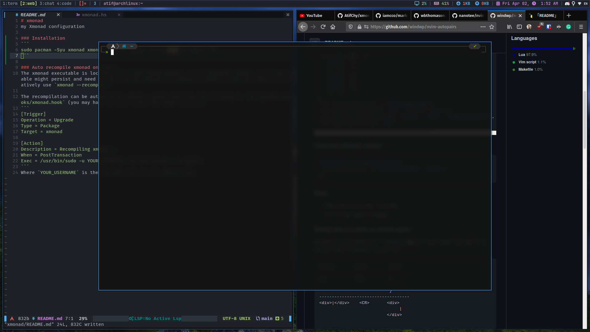
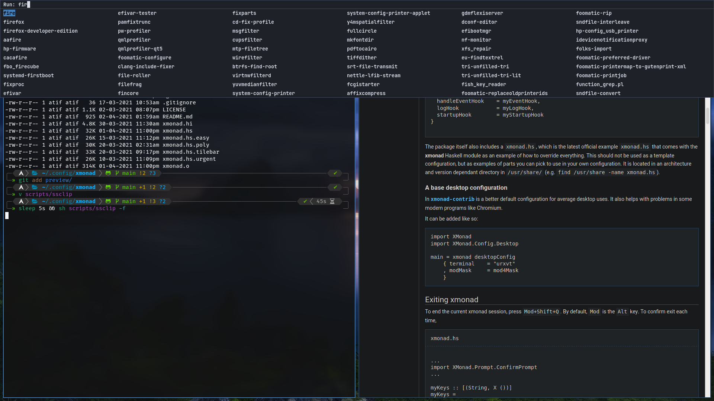

# xmonad
my [xmonad](https://github.com/xmonad/xmonad) configuration

### Preview



### Installation
```
sudo pacman -Syu xmonad xmonad-contrib xmobar stalonetray nm-applet feh
```

### Auto recompile xmonad on update
The xmonad executable is located in `~/.local/share/xmonad`. After upgrading xmonad, an old executable might persist and need in that case be removed for xmonad to compile a new executable. Alternatively use `xmonad --recompile`.

The recompilation can be automated by adding a pacman hook like the following to `/etc/pacman.d/hooks/xmonad.hook` (you may have to first create the hooks directory
```
[Trigger]
Operation = Upgrade
Type = Package
Target = xmonad

[Action]
Description = Recompiling xmonad...
When = PostTransaction
Exec = /usr/bin/sudo -u YOUR_USERNAME /usr/bin/xmonad --recompile
```
Where `YOUR_USERNAME` is the username that you run xmonad from.
